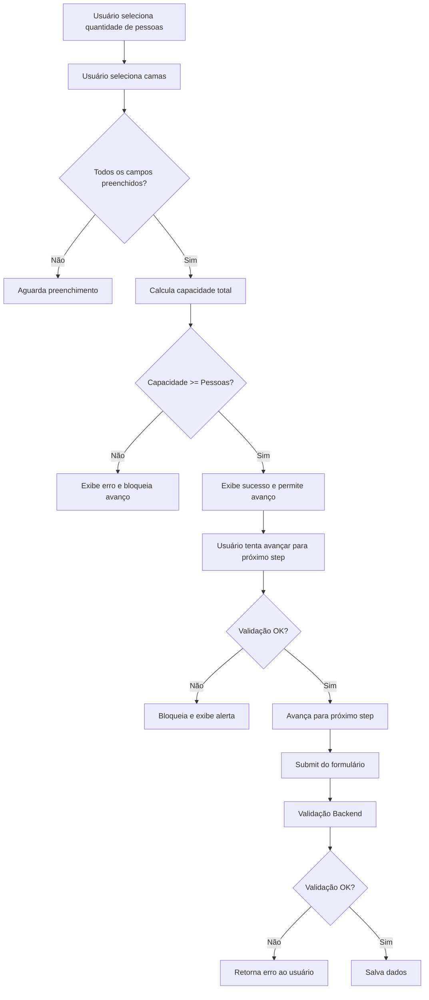

# Validação de Capacidade de Camas - Documentação Técnica

## 📋 Visão Geral

Sistema profissional de validação de capacidade de camas implementado para garantir que o número de pessoas informado no cadastro seja compatível com a quantidade de camas disponíveis na cota hoteleira.

## 🎯 Objetivo

Garantir que os usuários não possam cadastrar cotas com quantidade de pessoas superior à capacidade das camas informadas, evitando inconsistências nos dados e problemas futuros na locação.

## 📐 Regras de Negócio

### Capacidade por Tipo de Cama

| Tipo de Cama | Capacidade |
|--------------|------------|
| Cama de Solteiro | 1 pessoa |
| Cama de Casal | 2 pessoas |
| Sofá Cama | 2 pessoas |

### Fórmula de Cálculo

```
Capacidade Total = (Camas de Casal × 2) + (Camas de Solteiro × 1) + (Sofás Cama × 2)
```

### Validação

- ✅ **VÁLIDO**: Capacidade Total >= Número de Pessoas
- ❌ **INVÁLIDO**: Capacidade Total < Número de Pessoas

## 🎨 Implementação Frontend

### Localização
Arquivo: `resources/views/auth/register.blade.php`
Linhas: 2591-2791

### Funcionalidades

#### 1. Validação em Tempo Real
```javascript
function validateBedCapacity(prefix)
```
- Calcula a capacidade total baseada nas camas selecionadas
- Compara com o número de pessoas
- Retorna objeto com status de validação e mensagem

#### 2. Feedback Visual Dinâmico
```javascript
function showBedCapacityFeedback(prefix, validation)
```
- Exibe alerta verde (sucesso) ou vermelho (erro)
- Mostra mensagem clara e informativa
- Destaca campos com erro em vermelho
- Remove feedback anterior automaticamente

#### 3. Mensagens de Feedback

**Capacidade Insuficiente:**
```
❌ Capacidade insuficiente! As camas selecionadas comportam apenas X pessoa(s), 
mas você informou Y pessoa(s). Por favor, ajuste a quantidade de camas.
```

**Capacidade com Folga:**
```
✓ Capacidade adequada! As camas comportam X pessoa(s) para Y pessoa(s).
```

**Capacidade Exata:**
```
✓ Perfeito! Capacidade exata de X pessoa(s).
```

#### 4. Prevenção de Avanço
```javascript
function validateBedCapacityBeforeNext(prefix)
```
- Bloqueia o avanço para o próximo step se a validação falhar
- Exibe alerta ao usuário
- Faz scroll automático para o feedback visual

### Event Listeners

Os campos monitorados são:
- `{prefix}_quota_people` (Número de pessoas)
- `{prefix}_quota_double_bed` (Camas de casal)
- `{prefix}_quota_single_bed` (Camas de solteiro)
- `{prefix}_quota_sofa_bed` (Sofás cama)

Onde `prefix` pode ser:
- `gestor` - Para gestores autorizados (has_quota = 2)
- `owner` - Para proprietários (has_quota = 1)

## 🔒 Implementação Backend

### Localização
Arquivo: `app/Http/Controllers/AuthController.php`
Linhas: 133-188

### Validação de Segurança

#### Para Proprietários (has_quota = 1)
```php
if ($request->has_quota == '1') {
    $numPeople = (int) $request->owner_quota_people;
    $numDoubleBeds = (int) $request->owner_quota_double_bed;
    $numSingleBeds = (int) $request->owner_quota_single_bed;
    $numSofaBeds = (int) $request->owner_quota_sofa_bed;
    
    $totalCapacity = ($numDoubleBeds * 2) + ($numSingleBeds * 1) + ($numSofaBeds * 2);
    
    if ($totalCapacity < $numPeople) {
        $customErrors['owner_quota_double_bed'] = sprintf(
            'A capacidade das camas é insuficiente. As camas selecionadas comportam apenas %d pessoa%s, mas você informou %d pessoa%s. Por favor, ajuste a quantidade de camas.',
            $totalCapacity,
            $totalCapacity !== 1 ? 's' : '',
            $numPeople,
            $numPeople !== 1 ? 's' : ''
        );
    }
}
```

#### Para Gestores (has_quota = 2)
```php
if ($request->has_quota == '2') {
    $numPeople = (int) $request->gestor_quota_people;
    $numDoubleBeds = (int) $request->gestor_quota_double_bed;
    $numSingleBeds = (int) $request->gestor_quota_single_bed;
    $numSofaBeds = (int) $request->gestor_quota_sofa_bed;
    
    $totalCapacity = ($numDoubleBeds * 2) + ($numSingleBeds * 1) + ($numSofaBeds * 2);
    
    if ($totalCapacity < $numPeople) {
        $customErrors['gestor_quota_double_bed'] = sprintf(
            'A capacidade das camas é insuficiente. As camas selecionadas comportam apenas %d pessoa%s, mas você informou %d pessoa%s. Por favor, ajuste a quantidade de camas.',
            $totalCapacity,
            $totalCapacity !== 1 ? 's' : '',
            $numPeople,
            $numPeople !== 1 ? 's' : ''
        );
    }
}
```

## 📊 Exemplos de Uso

### Exemplo 1: Configuração Válida (Exata)
- **Pessoas**: 6
- **Camas de Casal**: 1 (= 2 pessoas)
- **Camas de Solteiro**: 2 (= 2 pessoas)
- **Sofás Cama**: 1 (= 2 pessoas)
- **Capacidade Total**: 6 pessoas ✅
- **Resultado**: ✓ Perfeito! Capacidade exata de 6 pessoas.

### Exemplo 2: Configuração Válida (Com Folga)
- **Pessoas**: 4
- **Camas de Casal**: 2 (= 4 pessoas)
- **Camas de Solteiro**: 1 (= 1 pessoa)
- **Sofás Cama**: 0 (= 0 pessoas)
- **Capacidade Total**: 5 pessoas ✅
- **Resultado**: ✓ Capacidade adequada! As camas comportam 5 pessoas para 4 pessoas.

### Exemplo 3: Configuração Inválida
- **Pessoas**: 6
- **Camas de Casal**: 1 (= 2 pessoas)
- **Camas de Solteiro**: 1 (= 1 pessoa)
- **Sofás Cama**: 0 (= 0 pessoas)
- **Capacidade Total**: 3 pessoas ❌
- **Resultado**: ❌ Capacidade insuficiente! As camas selecionadas comportam apenas 3 pessoas, mas você informou 6 pessoas. Por favor, ajuste a quantidade de camas.

## 🎯 Fluxo de Validação



## ✅ Benefícios da Implementação

1. **Validação Dupla**: Frontend + Backend = Máxima segurança
2. **Feedback em Tempo Real**: Usuário é informado imediatamente sobre problemas
3. **UX Profissional**: Mensagens claras e interface amigável
4. **Prevenção de Erros**: Impossível cadastrar dados inconsistentes
5. **Manutenibilidade**: Código bem estruturado e documentado
6. **Reutilizável**: Mesma função serve para gestores e proprietários

## 🔧 Manutenção

### Para Alterar as Regras de Capacidade

1. **Frontend**: Modificar a função `validateBedCapacity` no arquivo `register.blade.php`
2. **Backend**: Modificar o cálculo em `AuthController.php`

### Para Adicionar Novos Tipos de Cama

1. Adicionar campo no formulário
2. Incluir na fórmula de cálculo (frontend e backend)
3. Atualizar documentação

## 📝 Notas Técnicas

- A validação é aplicada apenas quando `has_quota` = 1 (proprietário) ou 2 (gestor)
- Usuários sem cota (has_quota = 0) não precisam dessa validação
- A validação frontend é não-bloqueante até a tentativa de avançar para o próximo step
- A validação backend é final e impede o cadastro de dados inválidos

## 👨‍💻 Desenvolvido por

Sistema implementado em: Outubro de 2025
Linguagens: JavaScript (ES6+), PHP 8+
Framework: Laravel 11

---

**Status**: ✅ Implementado e Testado
**Versão**: 1.0.0

